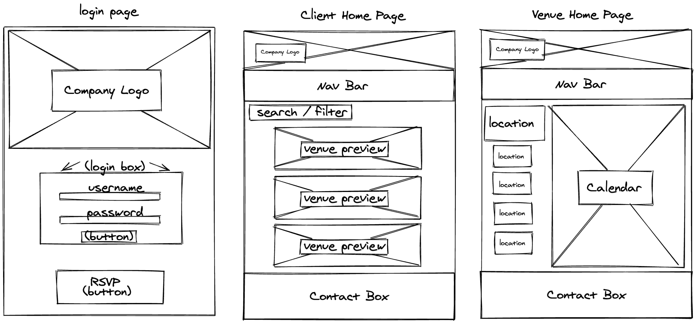
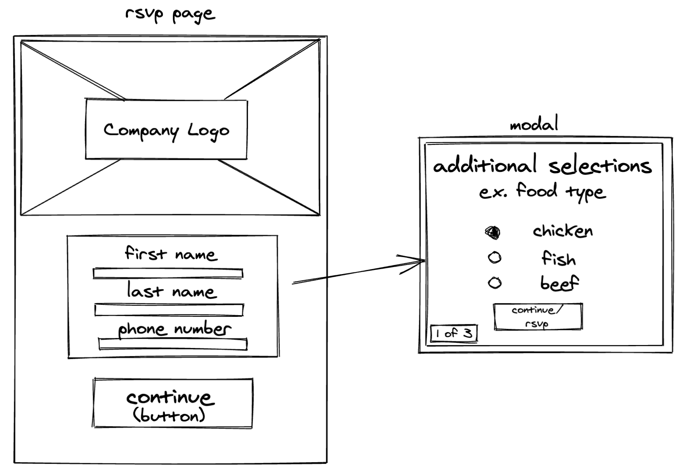
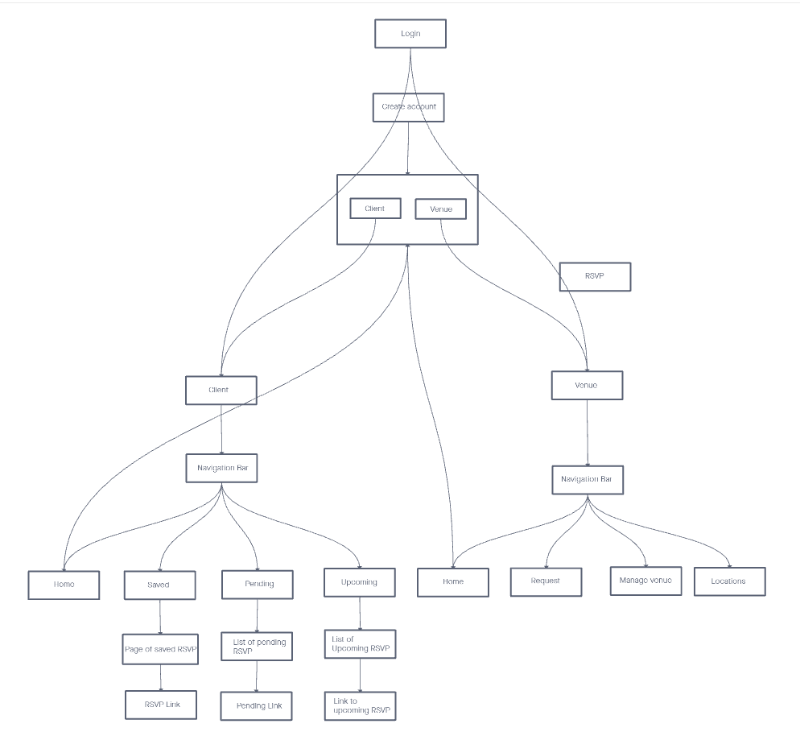
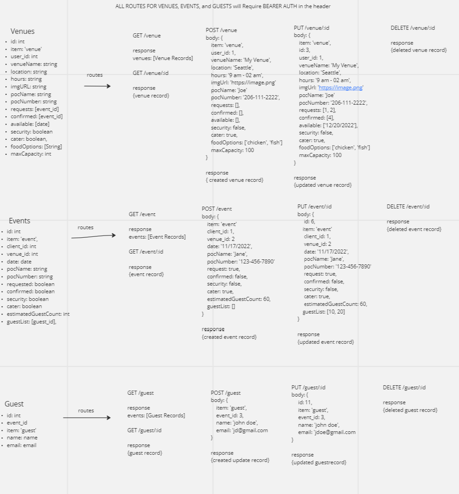

# Event Planner (Frontend/Client & Host)

## Meet the Team
- Alfredo Orquiz
- Brooke Heck
- Carlos Herrera
- David Tusia

[Trello Board](https://trello.com/invite/b/22nQw26F/ATTIa1b1ab0116cedeefaa60d440c244a630D8A042E5/event-planner-board)

[Deployed Server](https://the-better-event-planner.netlify.app/)

## Brief Description of Concept
Event planning website (mobile application pending) that links party planning clients and owners of venues together! Main focus of the website is to be the third party host, similar to an AirBnb, but for the event hosting market! Clients and hosts will login their specifically designed browsers where the hots can list and de-list their venues, while the clients can select and choose whatever those venues have as options.

_This repo specifically handles all information processed on the frontend_

## Wire Frame and UML

### Wire Frame

### React Tree

### Server Routes

## Available Scripts

In the project directory, you can run:

npm start
Runs the app in the development mode.
Open http://localhost:3000 to view it in your browser.

The page will reload when you make changes.
You may also see any lint errors in the console.

npm test
Launches the test runner in the interactive watch mode.
See the section about running tests for more information.

npm run build
Builds the app for production to the build folder.
It correctly bundles React in production mode and optimizes the build for the best performance.

The build is minified and the filenames include the hashes.
Your app is ready to be deployed!

See the section about deployment for more information.

npm run eject
Note: this is a one-way operation. Once you eject, you can't go back!

If you aren't satisfied with the build tool and configuration choices, you can eject at any time. This command will remove the single build dependency from your project.

Instead, it will copy all the configuration files and the transitive dependencies (webpack, Babel, ESLint, etc) right into your project so you have full control over them. All of the commands except eject will still work, but they will point to the copied scripts so you can tweak them. At this point you're on your own.

You don't have to ever use eject. The curated feature set is suitable for small and middle deployments, and you shouldn't feel obligated to use this feature. However we understand that this tool wouldn't be useful if you couldn't customize it when you are ready for it.
